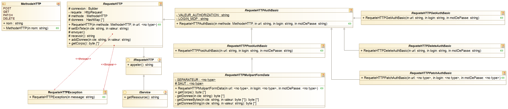
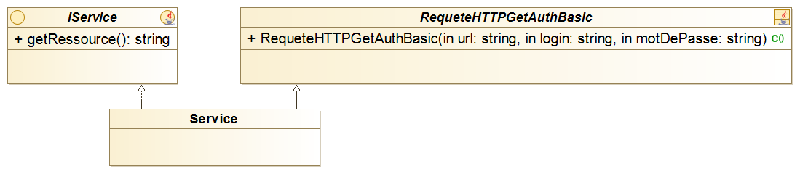

# API Invoker

## Préquel
**Ce projet est sous licence GNU-GPL, c'est-à-dire que vous pouvez :**
* Exécuter le logiciel, pour n'importe quel usage ;
* Étudier le fonctionnement d'un programme et de l'adapter à ses besoins, ce qui passe par l'accès aux codes sources ;
* La liberté de redistribuer des copies ;
* **L'obligation de faire bénéficier la communauté des versions modifiées.** (Hé oui amis de la prestation de service et
  du privé, il faut faire tourner la roue, quand tu prends il faut aussi savoir donner).

## Introduction
API invoker est une libraire de base facilitant l'appel d'API. L'interconnexion des applications est désormais un fait, 
en conséquence j'ai eu pour idée de développer une libraire capable de mettre l'appel de services
d'api rapidement par extension.

Cette librairie à pour objectif de remplir des appels spécifiques dans le cadre de mes projets. En conséquence, même si 
aujourd'hui elle ne prend pas tous les cas de figure, elle remplit sa mission et tendra à évoluer selon mes besoins.

## Architecture de la librairie
La librairie est définie comme il suit sur le diagramme de classe ci-dessous :

Pour ajouter un service, il vous suffit d'étendre sur le type de requête voulut (POST, GET, ...) et implémenter 
l'interface <code>IService</code>. Il vous suffit juste ensuite d'implémenter les méthodes <code>getRessource</code> et
<code>appeler</code>.

## Tests Unitaires
Pour vérifier le bon fonctionnement de la librairie, celle-ci est livrée avec des tests unitaires. Ces tests sont 
conformes à l'appel d'un API installé en interne sur notre SI appelée Pastell. Vous devez réécrire ces tests si vous 
souhaitez vous connecter à une autre API. 

Dans le cas où vous possédez aussi une API Pastell, il vous suffit de créer une classe 
<code>VariablesStatiques.java</code> dans le dossier <code>/src/test/java</code> package 
<code>baobab.librairies.composant</code>. Cette classe devra contenir des paramètres de classe de types 
<code>String</code> avec les mots clés <code>final static</code>. 

Voici la liste des paramètres de classes nécessaires :
* L'hôte de connexion vers Pastell <code>HOTE</code>.
* Le login de connexion à l'API <code>LOGIN</code>.
* Le mot de passe du login. <code>MOT_DE_PASSE</code>.
* L'entité de création du dossier de test <code>ENTITE</code>.
* Le type de document à créer <code>TYPE</code> de valeur *test-pastell-ws-consumer*. Le type de dossier est contenu 
dans le dossier de resource du projet. Il vous faudra l'ajouter dans votre API et donner les droits adéquats au rôle du
login indiqué en second point de cette liste.

Ensuite, vous devrez ajouter un fichier <code>.pdf</code> dans le dossier <code>/src/test/resources</code> que vous 
appellerez <code>file_to_transfert.pdf</code>.

Enfin testez!